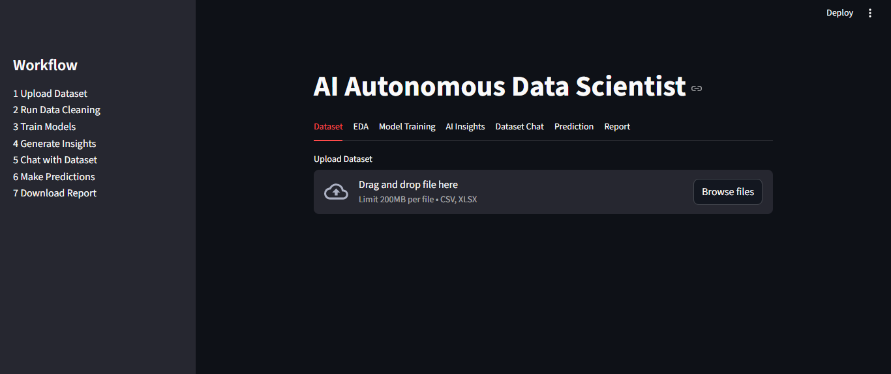
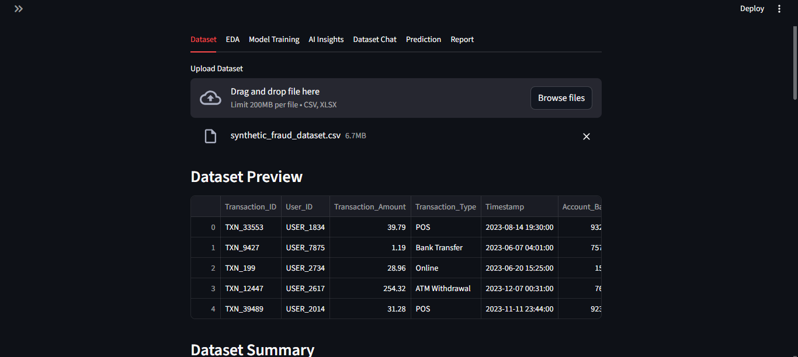
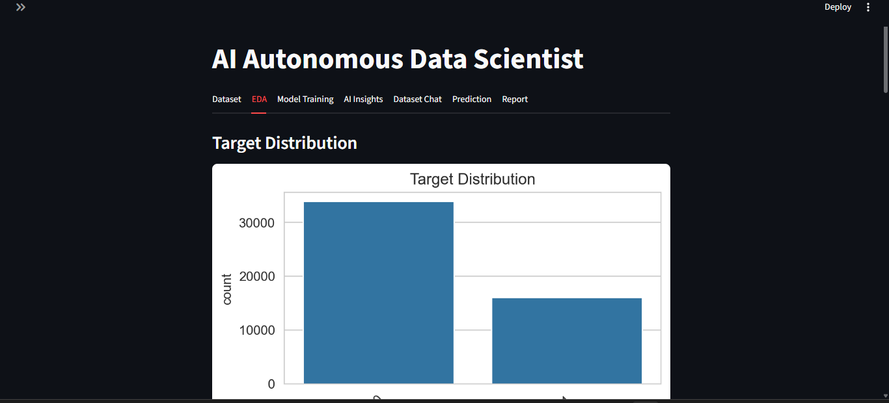
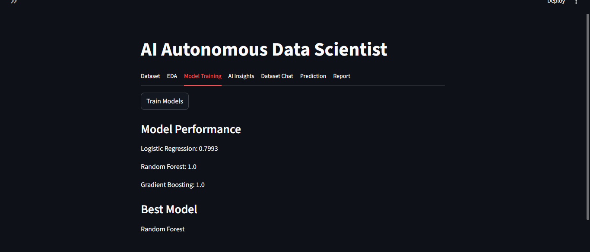
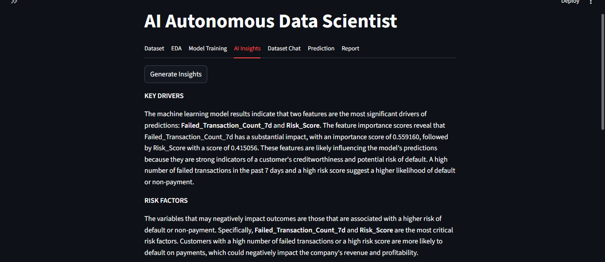
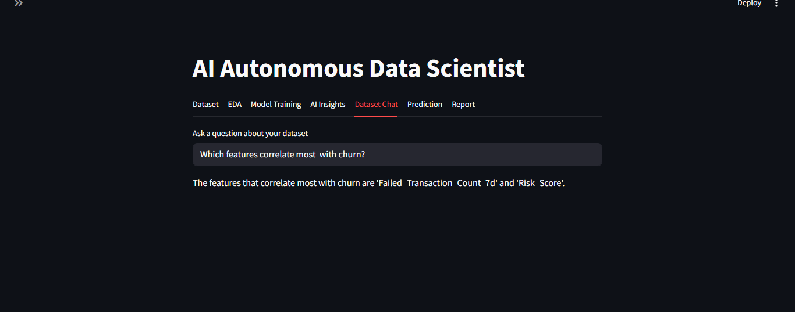
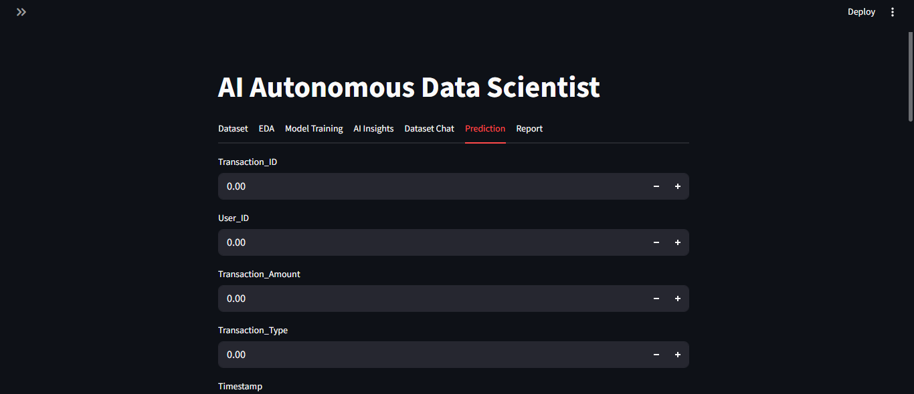
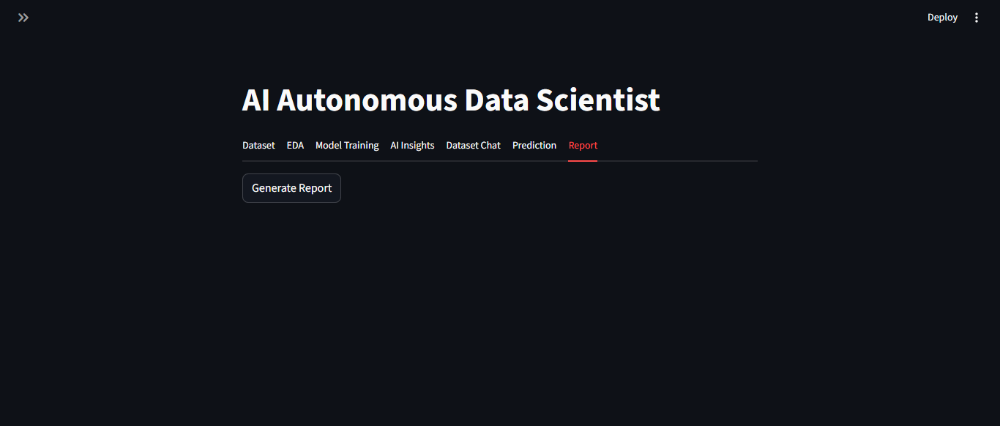

# InsightForge AI 

**Autonomous AI Data Scientist Platform**

InsightForge AI is an end-to-end AI system that automatically analyzes datasets, trains machine learning models, and generates business insights using large language models. The platform simulates the workflow of a **junior data scientist**, allowing users to upload datasets, explore insights, train models, and interact with the data through an AI chat interface.

This project combines **Machine Learning pipelines, LLM reasoning, automated analysis, and interactive dashboards** into a single application.

---

### System Flow

User → Streamlit Dashboard → Data Processing Pipeline → Model Training Engine → Model Evaluation → Feature Importance → AI Insight Generator → Dataset Chat Agent → Prediction Engine → Report Generator

---

# Features

### Automated Data Analysis

* Upload CSV or Excel datasets
* Automatic dataset summary
* Detection of numerical and categorical columns
* Missing value identification

### Data Cleaning Pipeline

* Handles missing values automatically
* Encodes categorical variables
* Scales numerical features
* Handles data imbalancing
* Handles outliers
* Handles Overfitting condition
* Prepares data for model training

### Automated EDA

* Target variable distribution
* Feature distributions
* Correlation heatmap
* Quick visual analysis dashboard

### Automated Model Training

Supports both **classification and regression tasks**

Models trained automatically:

* Logistic Regression
* Random Forest
* Gradient Boosting
* Linear Regression (for regression tasks)

### Model Evaluation

* Model performance comparison
* Best model selection
* Confusion matrix visualization (classification)

### Feature Importance Analysis

* Extracts feature importance from tree-based models
* Visualizes top predictors influencing the model

### AI Insight Generator

Uses LLM reasoning to produce business insights from model outputs and feature importance.

Example output:

1. Tenure is the strongest predictor of churn
2. Customers with monthly contracts churn more frequently
3. Higher monthly charges correlate with increased churn probability

### AI Dataset Chat

Users can ask natural language questions about the dataset.

Example queries:

* Which feature affects churn the most?
* What is the average income?
* Show correlation between spending and income.

### Prediction Interface

Users can input new feature values to generate predictions using the trained model.

### AI Report Generator

Automatically generates a **downloadable PDF report** containing:

* Model performance
* Key insights
* Summary of analysis

### Model Persistence

The best trained model is saved automatically using Joblib, allowing predictions without retraining.

---

# Project Structure

```
InsightForge-AI/
│
├── app.py
├── requirements.txt
├── README.md
├── .env.example
├── .gitignore
│
├── modules/
│   ├── data_loader.py
│   ├── data_analyzer.py
│   ├── data_cleaner.py
│   ├── eda.py
│   ├── model_trainer.py
│   ├── feature_importance.py
│   ├── predictor.py
│   └── report_generator.py
│
├── llm/
│   ├── insight_generator.py
│   └── dataframe_agent.py
│
├── saved_models/
│
├── assets/
│   ├── dashboard1.png
│   ├── dashboard2.png
│   
└── data/
```

---

# Technology Stack

### Core Data Science

* Python
* Pandas
* NumPy
* Scikit-learn

### Visualization

* Matplotlib
* Seaborn

### AI / LLM

* LangChain
* Groq LLM

### Application Framework

* Streamlit

### Model Management

* Joblib

### Reporting

* FPDF

---

# Dashboard Preview

### Dataset Analysis





### Model Performance



### AI Insights



### AI Chat



### AI Prediction and Report 



---

# Installation

Clone the repository:

```
git clone https://github.com/psawner/AI-Autonomous-Data-Scientist
```

Navigate into the project folder:

```
cd InsightForge-AI
```

Install dependencies:

```
pip install -r requirements.txt
```

Run the application:

```
streamlit run app.py
```

---

# Environment Variables

Create a `.env` file in the project root.

```
GROQ_API_KEY=your_api_key_here
```

---

# How It Works

1. Upload a dataset
2. Select the target column
3. Run automated analysis
4. View EDA and model performance
5. Get AI-generated insights
6. Chat with the dataset
7. Generate predictions
8. Download a PDF analysis report

---

# Example Use Cases

* Customer churn analysis
* Sales prediction
* Fraud detection datasets
* Financial risk modeling
* Exploratory data analysis automation

---


# License

This project is open-source and available under the MIT License.

---

# Author

Developed as an AI + Machine Learning portfolio project demonstrating:

* Machine Learning pipelines
* LLM integration
* AI agents
* Data analysis automation
* Interactive ML dashboards
